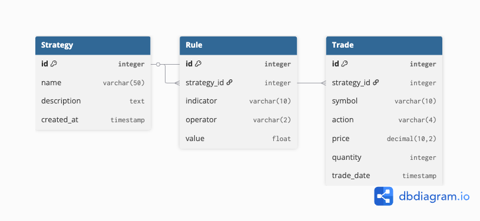

# Assignment Project: Real-Time Paper Trading and Backtesting Platform

This project is an advanced platform where users can design, test, and simulate simple trading strategies. It features a strategy builder for defining rules, connects to a brokerage API for market data, and includes a backtesting engine to run strategies against historical data. The platform also offers a real-time paper trading dashboard that uses WebSockets to display live portfolio updates as the market moves.

---

## Data Model

The data model is designed around three core entities: **Strategies**, **Rules**, and **Trades**. A `Strategy` is the central object, which contains one or more `Rules` that define its logic. When a strategy is simulated, it generates `Trades`, which are historical records of its performance.

Key relationships include:
*   A one-to-many relationship from `Strategy` to `Rule` (`on_delete=CASCADE`).
*   A one-to-many relationship from `Strategy` to `Trade` (`on_delete=PROTECT`) to preserve trade history.

## Views and Templates

For this assignment, the full Django request-response cycle was implemented to display data from the models. Two separate function-based views were created to demonstrate different methods of rendering a template: one using a manual `HttpResponse` and another using the `render()` shortcut. Both views serve the same template, which dynamically displays a list of trades from the database and includes a fallback message for when no trades are present.

## Class-Based Views (CBVs) & URL Refactoring
For this assignment, two styles of Class-Based Views (CBVs) were implemented: a base view inheriting from `django.views.View` and a generic view using `ListView`. This demonstrates the evolution from manual method handling to leveraging Django's powerful generic views. The project's URL structure was also refactored to use `include()`, making the app more modular and maintainable.

## Filtering and Aggregation
The Strategy list page now includes a search feature to filter strategies by name. The page also computes and displays summary statistics, such as the total number of strategies and grouped counts of rules and trades per strategy, using the Django ORM's `aggregate()` and `annotate()` functions.

## Static Assets & Charting
1.  **Static File Configuration:** Django's static files system was configured to serve a custom, professionally designed CSS stylesheet, providing a modern and clean theme across the entire application.
2.  **Dynamic Data Visualization:** A new view was created to dynamically generate a bar chart using the Matplotlib library. This chart is created in-memory from real-time database aggregations and served as a PNG image, which is then embedded directly into the Strategy Dashboard.

## Feature Overview: GET vs. POST and FBV vs. CBV

This week's assignment focused on Django's form handling capabilities. The project now includes a `GET` form for searching strategies and `POST` forms for creating new ones, demonstrating the key differences between these methods. The search feature uses a `GET` request, making the query visible in the URL, which is suitable for idempotent actions like retrieving data. In contrast, the create feature uses a `POST` request to securely send data to the server to create a new strategy, which is the correct method for actions that modify data.

To compare development styles, the create feature was implemented twice: once with a Function-Based View (FBV) and once with a Class-Based View (CBV). The FBV required explicit `if/else` logic to handle GET and POST requests, offering granular control. The CBV, using Django's generic `CreateView`, abstracted away this boilerplate, handling form validation and redirection automatically with much less code.

## JSON APIs and API-Driven Charts

1.  **JSON API Endpoints:**
    *   A function-based view at `/api/strategies/` returns a list of all strategies.
    *   A class-based view at `/api/strategies/summary/` returns aggregated data (the number of rules per strategy).
    *   These endpoints use Django's `JsonResponse` to correctly format the data and set the `Content-Type` header to `application/json`.

2.  **API-Driven Chart:**
    *   A new chart view was created that acts as a client to our own API. It fetches data from the `/api/strategies/summary/` endpoint, parses the JSON, and uses Matplotlib to generate a bar chart. This demonstrates a decoupled architecture where the data source is separate from the presentation layer.

## External API Integration

This week, the project was extended to integrate live data from an external public API.

**API Used: CoinGecko Cryptocurrency Prices**
*   The CoinGecko API provides real-time cryptocurrency price data with no API key required.
*   This is relevant to the paper trading platform as users can now view current crypto prices to inform their trading strategies.

**Implementation:**
*   A new view (`CryptoPriceView`) accepts a search query parameter (e.g., `?ids=bitcoin,ethereum`) and fetches data from the CoinGecko API using Python's `requests` library.
*   The view includes proper error handling for timeouts, network issues, and invalid responses using `try/except` blocks and `.raise_for_status()`.
*   A search form was added to the page so users can easily query any cryptocurrency by ID without manually editing the URL.
*   The response data is parsed and trimmed to show only the coin name and current USD price, making it clean and easy to read.