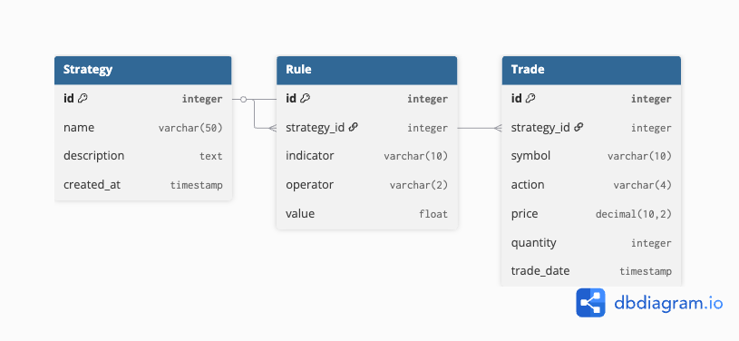

# Assignment Project: Real-Time Paper Trading and Backtesting Platform

This project is an advanced platform where users can design, test, and simulate simple trading strategies. It features a strategy builder for defining rules, connects to a brokerage API for market data, and includes a backtesting engine to run strategies against historical data. The platform also offers a real-time paper trading dashboard that uses WebSockets to display live portfolio updates as the market moves.

---

## Data Model

The data model is designed around three core entities: **Strategies**, **Rules**, and **Trades**. A `Strategy` is the central object, which contains one or more `Rules` that define its logic. When a strategy is simulated, it generates `Trades`, which are historical records of its performance.

Key relationships include:
*   A one-to-many relationship from `Strategy` to `Rule` (`on_delete=CASCADE`).
*   A one-to-many relationship from `Strategy` to `Trade` (`on_delete=PROTECT`) to preserve trade history.

